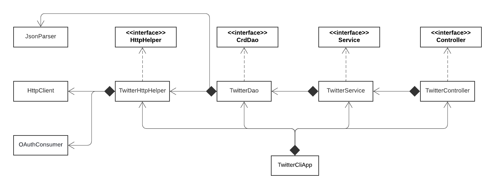

# Introduction
Using Twitter's REST API v1, this project intends to provide a backend that can CR(*)D (Create, Read, *, and Delete) tweets. This java programme follow the MVC architecture and use java Sprintboot and Spring framework with the @ComponentScan to manage all dependencies. HTTP client, basic Java libraries, maven, and SpringBoot are used to complete this operation. This app is available on [DockerHub].

# Quick Start
## How to package the app using Maven
```bash
git clone https://github.com/jarviscanada/jarvis_data_eng_BikervensBernard.git
cd ./jarviscanada/jarvis_data_eng_BikervensBernard/core_java/twitter

#compile and package your Java code
mvn clean compile package #same as mvn clean package
#inspect compiled bytecode/.class files
tree target
#inspect jar file
jar -tf target/java_apps-1.0-SNAPSHOT.jar
```

## How to build the app with Docker
```bash
git clone https://github.com/jarviscanada/jarvis_data_eng_BikervensBernard.git
cd ./jarviscanada/jarvis_data_eng_BikervensBernard/core_java/twitter

docker_user=[docker_user]
docker login -u ${docker_user}
#Create dockerfile (make sure you understand all commands)
cat > Dockerfile << EOF
FROM openjdk:8-alpine
COPY target/java_apps*.jar /usr/local/app/twitter/lib/twitter.jar
ENTRYPOINT ["java","-jar","/usr/local/twitter/grep/lib/twitter.jar"]
EOF

#Pakcage your java app
mvn clean package
#build a new docker image locally
docker build -t ${docker_user}/twitter .
#verify your image
docker image ls | grep "grep"
#Now we can package the app
mvn clean package
```

## How to run the app with Docker
```bash
#To pull my Docker image
docker pull bernard76/twitter
#To pull your Docker image
docker pull ${docker_user}/twitter
```
## Usage
```bash
container ${docker_user}/twitter post|show|delete [options]
#Posting a tweet:
container post [tweet_text] [latitude:longitude]
#Showing a tweet:
container show [tweet_id] [field1,fields2]
#Deleting a tweet:
container delete [id1,id2,..]
```
## Example
```bash
#set your twitter developer keys:
export consumerKey=YKEY1
export consumerSecret=KEY2
export accessToken=KEY3
export tokenSecret=KEY4

docker run --rm 
-e consumerKey=${consumerKey} \
-e consumerSecret=${consumerSecret} \
-e accessToken=${accessToken} \
-e tokenSecret=${tokenSecret} \
${docker_user}/twitter show 1539056805053186048 text
```

# Design
## UML diagram


MVC (Model, View, Controller) architecture (view from twitter's end)
The TwitterCLIApp specifically creates instances of the classes `TwitterHelper`, `TwitterDAO`, `TwitterService`, and `TwitterController`.
<br> `TwitterDAO` is used by `TwitterServicev`, which is controlled by `TwitterController`.
<br>The `HttpHelper` helps the `TwitterDAO` use Twitter's REST API v1.0a to perform CR*D operations on tweets.

## Componenta(app/main, controller, service, DAO)

- **[`TwitterDao`](./src/main/java/ca/jrvs/apps/twitter/dao/TwitterDAO.java)**: 
DAO layer classes only handle data with external storage, such as REST APIs. 
In this implementation TwitterDao contains methods to CR*D tweet. It communicates directly to twitter's api with the help of HttpHelper.
It also parse the http response into a Tweet object (model)

- **[`TwitterHttpHelper`](./src/main/java/ca/jrvs/apps/twitter/dao/helper/TwitterHttpHelper.java)**: 
sends Http post and Http get request using oauth.signpost and org.apache.http.client library.
- **[`TwitterService`](./src/main/java/ca/jrvs/apps/twitter/service/TwitterService.java)**: 
The service layer classes handled the business logic of the application. In this app, although business logic is very simple, 
it usually very completed (most codes are about business logic).

  - **Business logic:**

    - When you post a tweet, the service layer is responsible to check if the tweet text exceeds 140 characters and if lon/lat is out of range.
    - When you search for a Tweet, you need to check if user input IDs are in the correct format.
- **[`TwitterController`](./src/main/java/ca/jrvs/apps/twitter/controller/TwitterController.java)**:
This layer consumes user input (args in this app) and calls the corresponding service layer method. 
It does not handle any business logic.
- **[`TwitterCliApp`](./src/main/java/ca/jrvs/apps/twitter/spring/TwitterCLISpringBoot.java)**:
TwitterCLIApp with SpringBoot. The app's entry point. Spring Boot is basically an extension of the Spring framework 
which eliminated the boilerplate configurations required for setting up a Spring application. 
In addition, Spring Boot also comes with a default web servlet. 
@SpringBootApplication is a composition of multiple annotations which help you to configure Spring automatically. 
This is out of scope for this project. For now, you need to know this defines a SpringBoot app
    
## Models
Models are implemented with POJOs which is a class with private member variables and public getter and setters. 
This class encapsulates **simplified** Tweet data ([Tweet Objects](https://developer.twitter.com/en/docs/tweets/data-dictionary/overview/intro-to-tweet-json)) 
which often display in {} JSON format. 
In this application, we use the same Tweet model as Data Transfer Model (or DTO) and Data access model (or domain model).
The simplified model goes at follow:

| **Attribute**    | **Type**   | **Description**                                                                              |
|------------------|------------|----------------------------------------------------------------------------------------------|
| `created_at`     | String     | UTC time when this Tweet was created.                                                        |
| `id`             | BigInteger | The unique identifier for this Tweet. Use id_str to fetch the identifier to be safe.         |
| `id_str`         | String     | The string representation of the unique identifier for this Tweet.                           |
| `text`           | String     | The status update.                                                                           |
| `entities`       | Object     | Contains, in a list, the users that are mention, and the # used                              |
| `coordinates`    | Object     | Geographic location of this Tweet as reported by the client (longitude/ latitude).           |
| `retweet_count`  | int        | Number of times this Tweet has been retweeted.                                               |
| `favorite_count` | int        | Nullable. Indicates approximately how many times this Tweet has been liked by Twitter users. |
| `favorited`      | Boolean    | Nullable. Indicates whether this Tweet has been liked by the authenticating user.            |
| `retweeted`      | Boolean    | Indicates whether this Tweet has been Retweeted by the authenticating user.                  |

## Spring
The app uses constructors to insert any necessary dependencies.
We manually set up the dependency relationship and instantiated each component
in this TwitterCLIApp using the main method. It might work for a simple
project, but when you have multiple components, each of which has multiple dependencies,
it becomes quite difficult to manage (Multiple controllers, services, and DAOs are common in applications).
All dependencies are managed by the spring framework (it will replace your main method in your TwitterCLIApp).
With Spring, you can define the relationship between dependencies (e.g., TwitterHttpHelper is a dependent of TwitterDAO),
and the IoC container will automatically construct all components and dependencies in the appropriate sequence and set everything
up for you. The TwitterCLIApp.run() method, for instance, can thus be easily executed.
In the Spring framework, there are two most fundamental components, IoC container, and Beans.
The components/dependencies are call Beans in the Spring world. 
In other words, if a component/class/object is created/managed by an IoC container, it's a bean.
In TwitterCLIApp, `TwitterController`, `TwitterService`, `TwitterDao`, and `TwitterHttpHelper` are Beans 
since they care created by the `main` method which is the IoC container. 
Models are not Beans since they are not managed by the `main` method.
Spring Framework implementation of the Inversion of Control (IoC) principle is a process whereby objects define their dependencies only through constructor arguments. 
The IoC container then injects those dependencies when it creates the bean.

# Test
The app was tested using JUnit and Mockito. 
JUnit was used for integration testing and unit testing for `TwitterController`, `TwitterService`, `TwitterDao`.

## Deployment
```bash
#go to core_java/twitter given your curent directory
cd core_java/twitter

docker_user=[docker_user]
docker login -u ${docker_user} 
#Create dockerfile (make sure you understand all commands)
cat > Dockerfile << EOF
FROM openjdk:8-alpine
COPY target/java_apps*.jar /usr/local/app/twitter/lib/twitter.jar
ENTRYPOINT ["java","-jar","/usr/local/twitter/grep/lib/twitter.jar"]
EOF

#Pakcage your java app
mvn clean package
#build a new docker image locally
docker build -t ${docker_user}/twitter .
#verify your image
docker image ls | grep "grep"
#Now we can package the app
mvn clean package
```

# Improvements
- Implementation of more business logic
- Improve error handling/ management
- Improve model or upgrade from simplified to complete Tweet model
