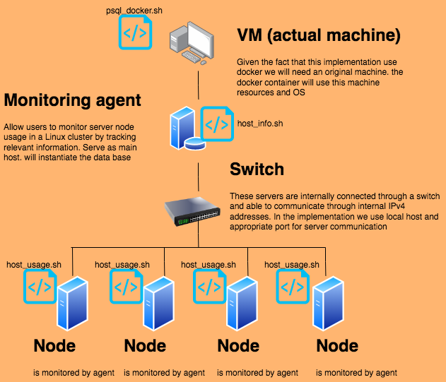

# Introduction

A CentOS 7 based Linux node cluster agent
This tool's goal is to keep track of each node's hardware characteristics and real-time resource utilisation (e.g. CPU/Memory) for future resource planning purposes (e.g. add/remove servers that might be too slow or under used). 
The data will be saved in a PostgreSQL relational database management system (RDBMS). 
The SQL queries will answer business questions such as 'show average memory usage in percentage over 1 minute intervals for each node'.

# Implementation

I will be in charge of designing and implementing a monitoring tool that will assist a potential business need using 
 - Linux command lines
 - Bash scripts
 - PostgreSQL
 - Docker

### **Architecture**



- A `psql` instance is used to persist all the data
- The `nodes` are docker containers sharing the same volume (the data parsist using psql volume)
- The `switch` will do the cluster networking. Each nodes are on a same network connected. In this implementation we use localhost and appropriate ports for testing
- The `host_info.sh` will be installed on 1 host/server/node and collects the host hardware info and insert it into the database. It will be run only once at the installation time.
- The `host_usage.sh` will be installed on every host/server/node and will gather memory/cpu usage. It will be triggered by the `crontab` job every minute.
- The `psql_docker.sh` will be installed on the main host and will start the docker demaon and make sure the containers are running

### **Postgres Database**

host_info table
| Attribut | Description | Type |
| --- | --- | --- |
| `host_id`| The unique identifier psql db auto-increment (PK)| SERIAL NOT NULL PRIMARY KEY SERIAL REFERENCES host_info(id)|
| `host_name`| The full name of the node| VARCHAR NOT NULL UNIQUE|
| `host_cpu_number`| The sum of cpu core| SMALLINT NOT NULL|
| `host_cpu_architecture`| The generation/ asrchitecture| VARCHAR NOT NULL|
| `host_cpu_model`| The manifacturer (e.g Intel(R) Xeon(R) CPU @ 2.30GHz)| VARCHAR NOT NULL UNIQUE|
| `host_cpu_mhz`| The cpu's clock rate in MHz| REAL NOT NULL|
| `host_L2_cache`| The sum, in kB, memory bank built into the CPU| REAL NOT NULL|
| `host_tot_memory`| The sum of ram, in kB| REAL NOT NULL|
| `host_timestamp`| Current time in UTC time zone| TIMESTAMP NOT NULL|

host_usage table
| Attribut | Description | Type |
| --- | --- | --- |
| `host_id`| unique identifier psql db auto-increment (FK) | SERIAL REFERENCES host_info(id)|
| `host_timestamp`| Current time in UTC time zone| TIMESTAMP NOT NULL|
| `host_free_memo`| The amount of memory not being used, in MB| REAL NOT NULL|
| `host_cpu_idel`| The percentage uptime of the CPU in idle state| REAL NOT NULL|
| `host_cpu_kernel`| The percentage uptime of the CPU in kernel mode| REAL NOT NULL|
| `host_disk_io`| The number of disk I/O made  | REAL NOT NULL|
| `host_disk_available`| The amount of disk space available from the root in MB| REAL NOT NULL|

# Test

Tested on a single machine instead of a Linux cluster but simulated a cluster using docker containers. 
However, should work in a cluster environment, assuming connection and firewalls are set up correctly (done by other teams). 
For bash scripts, you should test/verify all functionalities manually. You will need to verify the query result against test data (created by developers) for SQL scripts.

# Deployment/DevOps

The agent program is scheduled using `crontab`. Source code is managed by GitHub. Database is provisioned with Docker.

# Quick Start
- Create a psql instance using `psql_docker.sh`: bash ./scripts/psql_docker.sh create [database's username] [database's password] 
```
bash ./scripts/psql_docker.sh create postgres password
```

<br/>

- Start a psql instance using `psql_docker.sh`: By default the container's name is `postgres`
```
bash ./scripts/psql_docker.sh start
```

<br/>

- Stop a psql instance using `psql_docker.sh` : The database will be persisted
```
bash ./scripts/psql_docker.sh stop
```

<br/>

- Create tables using `ddl.sql` (this is ran during the container's creation. Therefore the create cmd on `psql_docker.sh` will have the same effect) : psql -h [postgres host] -U [postgres username] -d [database] -f [path to ddl.sql]
```
psql -h localhost -U postgres -d host_agent -f ./sql/ddl.sql
```

<br/>

- Using `host_info.sh` run ./scripts/host_usage.sh [postgres host] [postgres port] [database] [postgres username] [postgres password] once on the monitoring agent to insert hardware specs data into the DB
```
./scripts/host_usage.sh localhost 5432 host_agent posgress password
```

<br/>

- Insert each minute the hardware memory and cpu usage data into the DB using `host_usage.sh` <br/> ./scripts/host_usage.sh [host] [psql_port] [database] [database username] [database password]
```
./scripts/host_usage.sh localhost 5432 host_agent postgres password
```

<br/>

- Crontab setup to automate the host_usage.sh script's updates using Crontab. Here is how to set this up:
```
#edit crontab jobs
bash> crontab -e

#add this to crontab (always full path)
# vi / vim always begins in command mode. You can press [Esc] key anytime to return to command mode. Press i to insert text. 
# To save and exit from vi / vim, press [Esc] key and type ZZ
* * * * * bash /home/centos/Desktop/jarvis_data_eng_BikervensBernard/linux_sql/scripts/host_usage.sh localhost 5432 host_agent postgres password > /tmp/host_usage.log

#list crontab jobs
crontab -l

#validate your result from the psql instance
psql -h ...
> SELECT * FROM host_usage;
```

# Scripts
### **Description**
- `psql_docker.sh` provision a psql instance using docker. Stop, start, create and delete said docker's container
- `host_info.sh` collects hardware specification data and then insert the data to the psql instance. You can assume that hardware specifications are static, so the script will be executed only once. 
- `host_usage.sh` collects node's usage data and then insert the data into the psql database. The script will be executed every minute using Linux crontab 
- `crontab` insert a new entry to the host_usage table every minute when the server is healthy. We can assume that a server is failed when it inserts less than three data points within 5-min interval
- `queries.sql` (describe what business problem you are trying to resolve)

# Improvements
1. Create more table to store more result e.g. a table called 'grouped cpu' where each row represent the average cpu usage for a node with X amount of core. We could then compare and detect lack of efficiency 
2. Collect gpu data and statistics
3. Automation and modification of ressources allocation e.g. if a node is mostly idle we should utilize that node for more heavy work
